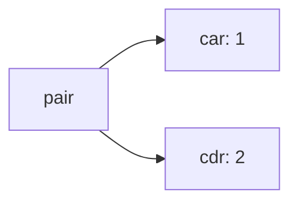
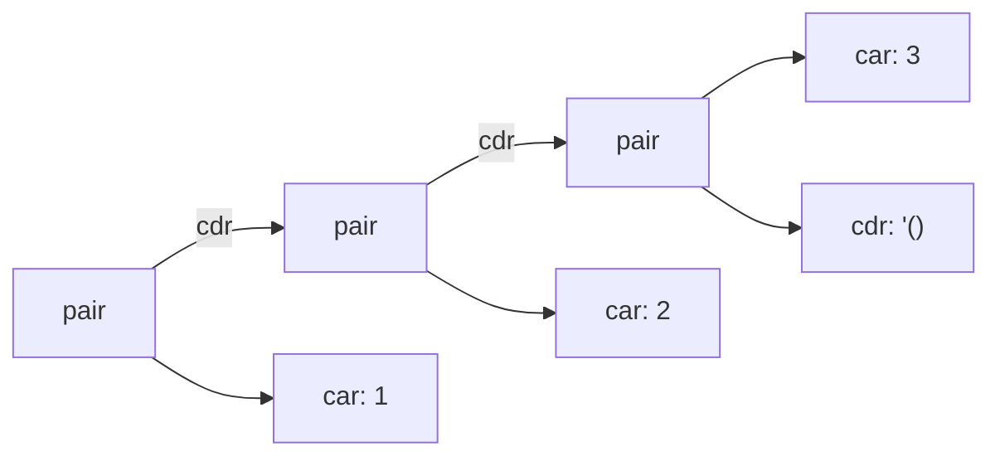

import CodeRunner from '@components/CodeRunner/CodeRunner.astro'
import KernelBar from '@components/CodeRunner/KernelBar.astro'

export const cell_number = `42`

export const cell_string = `"123"`

export const cell_boolean = `#t`

export const cell_add = `(+ 1 2)`

export const cell_add_many = `(+ 1 2 3 4 5)`

export const cell_nested = `(+ 1 (* 2 3))`

export const cell_atom_symbol = `'a`

export const cell_quoted_number_list = `'(1 2 3)`

export const cell_quote_number_list = `(quote (1 2 3))`

export const cell_unquoted_number_list = `(1 2 3)`

export const cell_sum_list = `(define (sum-list xs)
  (if (null? xs)
      0
      (+ (car xs)
         (sum-list (cdr xs)))))

(sum-list (list 1 2 3))`

export const cell_sum_list_unquoted = `(sum-list (1 2 3))`

export const cell_sum_list_quoted = `(sum-list '(1 2 3))`

export const cell_quoted_add = `'(+ 1 2)`

export const cell_cons_pair = `(define p (cons 1 2))
p`

export const cell_pair_car = `(car p)`

export const cell_pair_cdr = `(cdr p)`

export const cell_cons_chain = `(cons 1 (cons 2 (cons 3 '())))`

export const cell_list = `(list 1 2 3)`

export const cell_define_value = `(define pi 3.14)
pi`

export const cell_define_expr = `(define sum (+ 1 2))
sum`

export const cell_define_if = `(define label
  (if (> 3 2)
      "yes"
      "no"))

label`

export const cell_lambda_value = `(lambda (x) (* x x))`

export const cell_lambda = `((lambda (x) (* x x)) 5)`

export const cell_define_func_long = `(define square (lambda (x) (* x x)))
(square 5)`

export const cell_define_func_sugar = `(define (square x) (* x x))
(square 5)`

export const cell_define_threshold = `(define (free-shipping-threshold)
  99)

(free-shipping-threshold)`

export const cell_define_subtotal = `(define (subtotal price quantity)
  (* price quantity))

(subtotal 19.9 3)`

export const cell_define_passed = `(define (passed? score)
  (>= score 60))

(passed? 72)`

export const cell_define_grade = `(define (grade score)
  (cond ((>= score 90) "A")
        ((>= score 80) "B")
        ((>= score 60) "C")
        (else "D")))

(grade 86)`

export const cell_define_shipping_fee = `(define (shipping-fee amount)
  (cond ((>= amount 99) 0)
        ((>= amount 49) 6)
        (else 12)))

(shipping-fee 80)`

export const cell_define_cart_total = `(define (cart-total price quantity shipping)
  (+ (* price quantity) shipping))

(cart-total 19.9 3 6)`

export const cell_define_sum_to = `(define (sum-to n)
  (if (= n 0)
      0
      (+ n (sum-to (- n 1)))))

(sum-to 100)`

export const cell_loop_sum_list = `(define (sum-list xs)
  (if (null? xs)
      0
      (+ (car xs)
         (sum-list (cdr xs)))))

(sum-list '(1 2 3 4))`

export const cell_loop_length_list = `(define (length-list xs)
  (if (null? xs)
      0
      (+ 1 (length-list (cdr xs)))))

(length-list '(a b c))`

export const cell_loop_contains = `(define (contains? x xs)
  (cond ((null? xs) #f)
        ((equal? x (car xs)) #t)
        (else (contains? x (cdr xs)))))

(contains? 'b '(a b c))`

export const cell_loop_positive_numbers = `(define (positive-numbers xs)
  (cond ((null? xs) '())
        ((> (car xs) 0)
         (cons (car xs)
               (positive-numbers (cdr xs))))
        (else
         (positive-numbers (cdr xs)))))

(positive-numbers '(-2 3 0 5 -1))`

export const cell_if = `(if (> 3 2) "yes" "no")`

export const cell_cond = `(cond ((= 2 1) "one")
      ((= 2 2) "two")
      (else "other"))`

export const cell_core_self_evaluating = `(list 42 "123" #t)`

export const cell_core_quote_data = `(list 'a '(1 2 3) '(+ 1 2))`

export const cell_core_function_call = `(list (+ 1 2)
      ((lambda (x) (* x x)) 5))`

export const cell_core_if = `(if (> 3 2)
    "yes"
    "no")`

export const cell_core_lambda_define = `(define square
  (lambda (x) (* x x)))

(square 5)`

> “编程语言现在的发展，不过刚刚赶上 1958 年 Lisp 语言的水平。Lisp 在诞生之初，就已经包含了九个全新的思想：条件表达式、函数作为一等值、递归、动态类型、垃圾回收、表达式导向、symbol，以及代码的树形表示。读取期、编译期和运行期之间，并没有真正严格的界线；你可以在读取代码时编译或运行它，在编译代码时读取或运行它，也可以在运行时读取或编译它。”
>
> —— Paul Graham，《黑客与画家》

## 字面量（Literal Values）

<KernelBar lang="scheme" />

JavaScript 里，`42` 是一个数字值。Scheme 里也一样：

<CodeRunner lang="scheme" code={cell_number} />

字符串的写法也一样。JavaScript 写 `"123"`，Scheme 也写 `"123"`。

<CodeRunner lang="scheme" code={cell_string} />

布尔值写法不同：JavaScript 是 `true` / `false`，Scheme 是 `#t` / `#f`。

<CodeRunner lang="scheme" code={cell_boolean} />

## 表达式（Expressions）

JavaScript 写 `1 + 2`。`+` 放在两个数字中间，这叫**中缀表达式**。

Scheme 写：

<CodeRunner lang="scheme" code={cell_add} />

Scheme 把操作符放在最前面：`(+ 1 2)`。这叫**前缀表达式**。初看时，你可能会觉得这种写法有点怪，不太习惯。这种不习惯很大程度上只是因为我们从小学开始接触的算式基本都是中缀写法。

如果把 `+` 暂时换成一个普通函数名，这件事就会自然很多。JavaScript 里你会写：

```js
add(1, 2)
```

Scheme 里对应的是：

```scheme
(add 1 2)
```

这其实就是函数调用。Scheme 只是把函数名放在最前面，而且这个函数名可以直接是操作符，比如 `+`、`-`、`*`、`/`。所以 `(+ 1 2)`、`(/ 3 4)` 本质上都只是函数调用。

这样一来，Scheme 的写法会更一致：普通函数和四则运算在语法上是同一种结构。

这还带来一个额外的好处：操作符天然可以接收多个参数。

<CodeRunner lang="scheme" code={cell_add_many} />

计算可以嵌套。JavaScript 写 `1 + 2 * 3`，Scheme 写：

<CodeRunner lang="scheme" code={cell_nested} />

在 Scheme 里，括号直接写出了先后关系：先做 `(* 2 3)`，再把结果交给 `+`。所以你不需要记 `*` 比 `+` 优先，代码已经把结构写出来了。

先得到一条读法：

```scheme
(f a b c)
```

大致对应 JavaScript 里的：

```js
f(a, b, c)
```

括号里的第一个位置是函数，后面的位置是参数。

## 条件分支

JavaScript 用 `if (...) { ... } else { ... }` 做二选一。Scheme 的 `if` 也做二选一：

<CodeRunner lang="scheme" code={cell_if} />

按位置读：

- 第一个位置是 `if`。
- 第二个位置是条件：`(> 3 2)`。
- 第三个位置是条件成立时的结果：`"yes"`。
- 第四个位置是条件不成立时的结果：`"no"`。

JavaScript 里讲多分支，很多人会先想到 `switch / case`：

```js
switch (n) {
  case 1:
    "one"
    break
  case 2:
    "two"
    break
  default:
    "other"
}
```

Scheme 常用 `cond`。它看起来和 `switch / case` 有点像，但每一行放的不是一个固定分支标签，而是一个条件表达式：

<CodeRunner lang="scheme" code={cell_cond} />

同样的逻辑，如果用 JavaScript 的表达式风格来写，大概是：

```js
const result =
  2 === 1 ? "one" :
  2 === 2 ? "two" :
  "other"
```

## 命名

JavaScript 里，`const pi = 3.14` 是定义一个变量。Scheme 里对应的是 `define`：

<CodeRunner lang="scheme" code={cell_define_value} />

定义之后，就可以在后面的代码里引用它。

`define` 右边也可以是某个表达式：

<CodeRunner lang="scheme" code={cell_define_expr} />

也就是说，Scheme 会先把 `(+ 1 2)` 算出来，再把结果绑定到 `sum`。

前面刚见过的条件分支结果，也一样可以先算出来，再绑定到一个名字上：

<CodeRunner lang="scheme" code={cell_define_if} />

## 函数

前面已经见过函数调用：`(add 1 2)`、`(+ 1 2)`。如果要计算平方，我们希望能这样调用：

```scheme
(square 5)
```

为了让这个调用成立，需要先定义 `square`。Scheme 最常用的函数定义写法是：

<CodeRunner lang="scheme" code={cell_define_func_sugar} />

这段代码可以按位置读：

- `square` 是函数名。
- `x` 是参数。
- `(* x x)` 是函数体，也就是调用时真正要计算的表达式。

注意 `square` 和参数 `x` 外面还有一层括号：`(square x)`。这一组写在 `define` 后面，表示要定义的函数名和参数列表。

如果写成 JavaScript 的变量绑定形式，大致对应：

```js
const square = (x) => x * x

square(5)
```

函数不要求一定有几个参数。可以没有参数，也可以有一个、两个，或者更多参数。利用前面已经学过的函数调用、命名和条件分支，我们已经可以写几个接近真实代码的小函数了。

比如读取一个固定配置：

<CodeRunner lang="scheme" code={cell_define_threshold} />

计算订单小计：

<CodeRunner lang="scheme" code={cell_define_subtotal} />

判断分数是否及格：

<CodeRunner lang="scheme" code={cell_define_passed} />

给分数分档：

<CodeRunner lang="scheme" code={cell_define_grade} />

根据订单金额计算运费：

<CodeRunner lang="scheme" code={cell_define_shipping_fee} />

把商品金额和运费合起来：

<CodeRunner lang="scheme" code={cell_define_cart_total} />

还可以让函数调用自己。下面这个函数计算 `1 + 2 + ... + n`：

<CodeRunner lang="scheme" code={cell_define_sum_to} />

注意到这里用了递归：`sum-to` 在函数体里调用了自己。

## lambda 初步

JavaScript 里，可以只写一个没有名字的函数值：

```js
(x) => x * x
```

Scheme 里对应的写法是 `lambda`，它的求值结果就是一个函数值：

<CodeRunner lang="scheme" code={cell_lambda_value} />

也可以把这个函数值绑定到变量 `square`：

```js
const square = (x) => x * x

square(5)
```

对应到 Scheme，就是先用 `lambda` 做出函数值，再用 `define` 把它绑定到 `square`：

<CodeRunner lang="scheme" code={cell_define_func_long} />

这就是上一节简写形式背后的完整写法：

```scheme
(define (square x) (* x x))
```

这个函数值也可以不绑定名字，写完以后立刻调用。JavaScript 可以这样写：

```js
((x) => x * x)(5)
```

Scheme 里的 `lambda` 也可以这样直接调用。把整个 `lambda` 表达式放在函数位置，后面的 `5` 就是传给它的参数：

<CodeRunner lang="scheme" code={cell_lambda} />

这里最外层的括号表示一次函数调用。第一个位置不是名字，而是整个 `(lambda (x) (* x x))`；它先产生一个函数。后面的 `5` 是参数。也就是说，这段代码等价于“把 `x => x * x` 这个函数立刻应用到 `5` 上”。

最后把两种写法放在一起看：

```scheme
(define (square x) (* x x))

(define square
  (lambda (x) (* x x)))
```

第一种是常用的函数定义语法。第二种更接近底层含义：先构造一个函数值，再把名字 `square` 绑定到这个函数值上。两者表达的是同一件事；前者可以看作后者的语法糖。

## Atom（原子）

回顾一下前面已经见过的几类值：

```scheme
42
"123"
#t
#f
```

这些都可以单独出现，在 S 表达式的结构里不能再拆成更小的表达式，所以叫 Atom（原子）。这里说的“不可分割”是语法结构上的不可分割。

还有一种常见的 Atom 是 symbol。JavaScript 里可以写：

```js
Symbol('a')
```

Scheme 里常写成：

<CodeRunner lang="scheme" code={cell_atom_symbol} />

前面的 `'` 是单引号，表示引用。后面会专门解释引用。

## pair

Atom 是最小元素。再往上走一步，最小的组合结构是 **pair**。

`cons` 构造一个 pair。pair 有两个位置，左边叫 `car`，右边叫 `cdr`。这里先把这个 pair 命名为 `p`：

<CodeRunner lang="scheme" code={cell_cons_pair} />

`(1 . 2)` 表示：左边是 `1`，右边是 `2`。

对 `p` 使用 `car`，得到左边的值：

<CodeRunner lang="scheme" code={cell_pair_car} />

使用 `cdr`，得到右边的值：

<CodeRunner lang="scheme" code={cell_pair_cdr} />



如果 pair 的 `cdr` 继续接另一个 pair，并且最后以空列表 `'()` 结束，就能串成一个普通 list。

<CodeRunner lang="scheme" code={cell_cons_chain} />

这个结构更常用的写法是：

<CodeRunner lang="scheme" code={cell_list} />



这张图要看的重点是：普通 list 不是一整块数组，而是一串 pair。每个 pair 的 `car` 放当前元素，`cdr` 指向剩下的 list。

围绕 pair 和 list，最常用的是三个操作：

- `cons`：把一个值接到一个 list 前面。
- `car`：取第一个值。
- `cdr`：取剩下的 list。

## 列表（List）

上一小节已经看到，普通 list 可以由一串 pair 构造出来。实际写代码时，更常用的是 `list` 函数：

<CodeRunner lang="scheme" code={cell_list} />

有了列表，就可以把它交给函数处理。下面定义一个小函数，把列表里的数字加起来：

<CodeRunner lang="scheme" code={cell_sum_list} />

还记得前面的函数调用吗？

<CodeRunner lang="scheme" code={cell_add} />

它是一对括号包起来的列表形状。第一个位置是 `+`，而 `+` 是函数，所以可以正常求值。

加上引用以后，同样的结构就不再求值，而是一段列表数据：

<CodeRunner lang="scheme" code={cell_quoted_add} />

普通 list 的表面写法也像一组元素放在括号里：

<CodeRunner lang="scheme" code={cell_unquoted_number_list} />

可以先运行一下这段代码。它会报错，因为 Scheme 会把括号里的第一个位置当作函数来调用；这里的第一个位置是 `1`，而 `1` 不是函数。

所以，把列表作为参数传给函数时，不能直接写成这样：

<CodeRunner lang="scheme" code={cell_sum_list_unquoted} />

这里的 `(1 2 3)` 仍然会被当作函数调用。要表达列表数据本身，需要使用引用：

<CodeRunner lang="scheme" code={cell_sum_list_quoted} />

前面的 `'` 是 `quote` 的简写，意思是先把后面的东西当作数据。后面会专门解释引用。

完整写法是：

<CodeRunner lang="scheme" code={cell_quote_number_list} />

## 递归遍历

JavaScript 里常用 `for` 或 `while` 遍历数组。Scheme 里更常见的方式，是让函数沿着 list 的结构递归：空 list 是结束条件，非空 list 就处理 `(car xs)`，再递归处理 `(cdr xs)`。

Scheme 的核心写法不依赖 `for` / `while` 这类循环语句，很多循环都写成递归。这里有一个重要保证：Scheme 规范要求实现支持 proper tail recursion。也就是说，当递归调用处在尾位置时，实现必须像循环一样执行它，不让调用栈随着迭代次数增长。下面先写最直观的递归版本；尾递归写法可以后面再单独看。

### 求和

<CodeRunner lang="scheme" code={cell_loop_sum_list} />

### 计算长度

每遇到一个元素，就把剩下的长度加 `1`：

<CodeRunner lang="scheme" code={cell_loop_length_list} />

### 查找元素

<CodeRunner lang="scheme" code={cell_loop_contains} />

### 筛选正数

还可以在递归返回时重新构造 list。下面这个函数只保留正数：

<CodeRunner lang="scheme" code={cell_loop_positive_numbers} />

这几个例子结构相同：先判断 list 是否为空；如果不是空 list，就用 `car` 处理当前元素，用 `cdr` 进入剩下的 list。

## 最小内核

到这里，Scheme 的最小内核已经出现了。它可以用三组规则概括。

### 1. 语法结构

- Scheme 的代码都可以按 **S 表达式** 看。
- S 表达式要么是 atom，要么是 pair 结构。
- atom 是最小单位；pair 是组合单位。
- list 是最常见的 pair 结构，由 pair 链形成。

### 2. atom 的求值

- 数字、字符串、布尔值会得到自己。
- symbol 通常作为名字，到环境里查找它绑定的值。
- `quote` 会把后面的 symbol 或 list 当作数据。

<CodeRunner lang="scheme" code={cell_core_self_evaluating} />

<CodeRunner lang="scheme" code={cell_core_quote_data} />

### 3. list 作为代码时的求值

- 求值一个 list 时，先看第一个位置。
- 如果第一个位置是 special form，就按它自己的规则求值。
- 如果不是 special form，就按函数调用处理：求出函数，求出参数，再应用函数。

本文用到的核心特殊形式 / 定义形式：

- `quote`：把后面的东西当作数据。
- `if`：只求值被选中的分支。
- `lambda`：构造函数值。
- `define`：把名字绑定到值。

函数调用：

<CodeRunner lang="scheme" code={cell_core_function_call} />

special form：

<CodeRunner lang="scheme" code={cell_core_if} />

<CodeRunner lang="scheme" code={cell_core_lambda_define} />

前面用到的 `cons`、`car`、`cdr`、`null?`、`+`、`-`、`*`、`/`、`=`、`<`、`>` 都不是新的语法规则，只是环境里已经绑定好的函数。`cond`、`and`、`or`、`let`、`case`、`do` 等常见形式，可以留到后面再看：它们都可以围绕这套更小的规则来理解。
