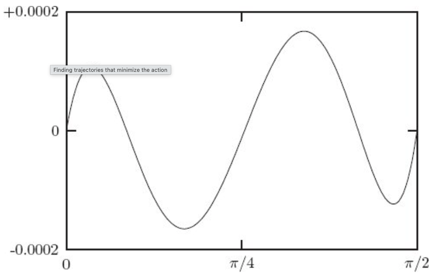

### 1.4 计算作用量

为了阐释上述思想，并介绍如何将其表述为计算机程序，我们考虑最简单的力学系统——一个在三维空间中运动的**自由粒子**。

欧拉 (Euler) 和拉格朗日 (Lagrange) 发现，对于一个自由粒子，其动能沿真实路径的时间积分，小于沿任何其他连接相同端点的替代路径的积分：一个自由粒子按照平稳作用量原理运动，前提是我们取拉格朗日量为其**动能**。

一个质量为 $m$、速度为 $\vec{v}$ 的粒子的动能是 $\frac{1}{2} m v^2$，其中 $v$ 是 $\vec{v}$ 的大小。在这种情况下，我们可以选择普通的直角坐标作为广义坐标。

根据欧拉和拉格朗日，自由粒子的拉格朗日量为：²⁴

$$
L(t, x, v) = \frac{1}{2} m (v \cdot v),
\tag{1.6}
$$

其中形式参数 $x$ 命名了一个（代表）位置分量的元组，形式参数 $v$ 命名了一个（代表）速度分量的元组。²⁵

-----

#### **在 Scheme 中实现 💻**

我们可以将这个公式表示为一个**程序 (procedure)**：

```scheme
(define ((L-free-particle mass) local)
  (let ((v (velocity local)))
    (* 1/2 mass (dot-product v v))))
```

该定义表明，`L-free-particle` 是一个接受 `mass` (质量) 作为参数的程序，它返回*另一个*程序。返回的这个程序接受一个 `local` (局域元组) 作为参数，用 `velocity` 程序提取广义速度，并用该速度计算拉格朗日量的值。²⁶

假设我们用 $q$ 表示一个坐标路径函数，它将时间映射到位置分量：²⁷

$$q(t) = (x(t), y(t), z(t)).
\\tag{1.7}
$$

我们可以这样定义：²⁸

```scheme
(define q
  (up (literal-function ’x)
      (literal-function ’y)
      (literal-function ’z)))
```

其中 `literal-function` (字面函数) 创建一个程序，该程序代表一个单参数函数，除了给定的符号名称外，没有其他已知属性。符号 `q` 现在命名了一个接受一个实数参数（时间）的程序，它产生一个代表该时刻坐标的三分量元组。例如，我们可以对一个符号时间 `t` 来求值这个程序：

```scheme
(q ’t)
(up (x t) (y t) (z t))
```

坐标路径的导数 $Dq$ 是将时间映射到速度分量的函数：

$$
Dq(t) = (Dx(t), Dy(t), Dz(t)).
$$

我们可以创建并使用一个函数的导数。²⁹ 例如，我们可以写：

```scheme
((D q) ’t)
(up ((D x) t) ((D y) t) ((D z) t))
```

函数 $\Gamma$ 接受一个坐标路径，并返回一个时间的函数，该函数给出局域元组 $(t, q(t), Dq(t), \dots)$。我们用程序 `Gamma` 来实现这个 $\Gamma$。³⁰ `Gamma` 的作用如下：

$$
\Gamma[q](t) = (t, q(t), Dq(t), \dots).
$$

```scheme
((Gamma q) ’t)
(up t
  (up (x t) (y t) (z t))
  (up ((D x) t) ((D y) t) ((D z) t)))
```

因此，复合 $L \circ \Gamma$ 是一个时间的函数，它返回路径上该点的拉格朗日量的值：³¹

```scheme
((compose (L-free-particle ’m) (Gamma q)) ’t)
(+ (* 1/2 m (expt ((D x) t) 2))
   (* 1/2 m (expt ((D y) t) 2))
   (* 1/2 m (expt ((D z) t) 2)))
```

程序 `show-expression` 会简化表达式，并使用 TeX 以传统的中缀形式显示结果。我们用这个方法生成书中的盒装表达式。`show-expression` 也会产生前缀形式，但我们通常不显示它。³²

```scheme
(show-expression
  ((compose (L-free-particle ’m) (Gamma q)) ’t))
```

$$
\frac{1}{2} m(Dx(t))^2 + \frac{1}{2} m(Dy(t))^2 + \frac{1}{2} m(Dz(t))^2
$$

根据方程 (1.4)，我们可以计算从时间 $t_1$ 到 $t_2$ 的拉格朗日作用量：

```scheme
(define (Lagrangian-action L q t1 t2)
  (definite-integral (compose L (Gamma q)) t1 t2))
```

`Lagrangian-action` 接受一个计算拉格朗日量的程序 `L`、一个计算坐标路径的程序 `q`，以及起始和结束时间 $t_1$ 和 $t_2$ 作为参数。这里使用的 `definite-integral` (定积分) 接受一个函数和两个极限 $t_1, t_2$ 作为参数，并计算该函数在 $t_1$ 到 $t_2$ 区间上的定积分。³³

请注意，`Lagrangian-action` 的定义不依赖于任何特定的坐标集，甚至不依赖于位形空间的维度。从拉格朗日量的坐标表示和坐标路径计算作用量的方法，不依赖于坐标系。

现在我们可以计算自由粒子沿某条路径的作用量。例如，考虑一个粒子沿直线 $t \mapsto (4t + 7, 3t + 5, 2t + 1)$ 匀速运动。³⁴ 我们将该路径表示为一个程序：

```scheme
(define (test-path t)
  (up (+ (* 4 t) 7)
      (+ (* 3 t) 5)
      (+ (* 2 t) 1)))
```

对于一个质量为 3 的粒子，我们得到 $t=0$ 到 $t=10$ 之间的作用量为：³⁵

```scheme
(Lagrangian-action (L-free-particle 3.0) test-path 0.0 10.0)
435.
```

-----

**练习 1.4：拉格朗日作用量**

对于一个自由粒子，一个合适的拉格朗日量是：³⁶

$$
L(t, x, v) = \frac{1}{2} m v^2.
\tag{1.8}
$$

假设 $x$ 是一条自由粒子的匀速直线路径，使得 $x_a = x(t_a)$ 且 $x_b = x(t_b)$。证明该解路径上的作用量为：

$$
\frac{m}{2} \frac{(x_b - x_a)^2}{t_b - t_a}.
\tag{1.9}
$$

-----

#### **最小作用量路径**

我们已经知道，自由粒子的实际路径是匀速直线运动。根据欧拉和拉格朗日，沿直线测试路径的作用量小于沿邻近路径的作用量。

设 $q$ 为一条直线测试路径，其作用量为 $S[q](t_1, t_2)$。设 $q + \epsilon\eta$ 为一条邻近路径，它是通过将路径 $q$ 加上一个按实数参数 $\epsilon$ 缩放的路径**变分** $\eta$ 得到的。³⁷ 变分路径上的作用量为 $S[q + \epsilon\eta](t_1, t_2)$。欧拉和拉格朗日发现，对于任何在端点处为零的 $\eta$ 以及任何非零的微小 $\epsilon$，都有 $S[q + \epsilon\eta](t_1, t_2) > S[q](t_1, t_2)$。

让我们通过改变测试路径来进行数值检验，即加上某个在端点 $t=t_1$ 和 $t=t_2$ 处为零的测试函数。为了构造一个在端点处为零的函数 $\eta$，给定一个性质足够好的函数 $\nu$，我们可以使用 $\eta(t) = (t - t_1)(t - t_2)\nu(t)$。这可以实现为：

```scheme
(define ((make-eta nu t1 t2) t)
    (* (- t t1) (- t t2) (nu t)))
```

我们可以用它来计算自由粒子沿变分路径的作用量，将其作为 $\epsilon$ 的函数：³⁸

```scheme
(define ((varied-free-particle-action mass q nu t1 t2) eps)
    (let ((eta (make-eta nu t1 t2)))
        (Lagrangian-action
            (L-free-particle mass)
            (+ q (* eps eta))
            t1
            t2)))
```

对于变分路径，取 $\nu(t) = (\sin t, \cos t, t^2)$ 且 $\epsilon = 0.001$，其作用量正如预期的那样，大于测试路径的作用量：

```scheme
((varied-free-particle-action 3.0 test-path
    (up sin cos square)
    0.0 10.0)
  0.001)
436.29121428571153
```

我们可以数值计算使作用量最小的 $\epsilon$ 值。我们在（比如说）-2 和 1 之间搜索：³⁹

```scheme
(minimize
    (varied-free-particle-action 3.0 test-path
        (up sin cos square)
        0.0 10.0)
    -2.0 1.0)
(-1.5987211554602254e-14 435.0000000000237 5)
```

我们得到了完全符合预期的结果——$\epsilon$ 的最佳值是零，⁴⁰ 并且作用量的最小值就是沿直线路径的作用量。

-----

#### **寻找使作用量最小的轨迹**

我们已经使用变分原理来确定给定轨迹是否可实现。我们也可以使用变分原理来**寻找**轨迹。

给定一组由有限数量参数指定的轨迹，我们可以通过寻找使作用量最小的那条轨迹，来搜索参数空间以最佳逼近真实轨迹。通过选择一组好的逼近函数，我们可以任意地接近真实轨迹。⁴¹

一种构造具有固定端点的参数化路径的方法是使用一个多项式，该多项式穿过两个端点以及若干个中间点。改变中间点的位置就可以使路径发生变分；变分路径的参数就是这些中间位置的坐标。程序 `make-path` 使用**拉格朗日插值多项式** (Lagrange interpolation polynomial) 来构造这样一条路径。`make-path` 被调用时有五个参数：`(make-path t0 q0 t1 q1 qs)`，其中 `q0` 和 `q1` 是端点，`t0` 和 `t1` 是对应的时间，`qs` 是中间点的列表。⁴²

指定了参数化路径后，我们可以构造一个**参数化作用量 (parametric action)**，它就是沿该参数化路径计算的作用量：

```scheme
(define ((parametric-path-action Lagrangian t0 q0 t1 q1) qs)
    (let ((path (make-path t0 q0 t1 q1 qs)))
        (Lagrangian-action Lagrangian path t0 t1)))
```

我们可以通过寻找使作用量最小化的参数来找到近似的解路径。我们用一个现成的**多维最小化程序** (multidimensional minimization procedure) 来完成这个最小化：⁴³

```scheme
(define (find-path Lagrangian t0 q0 t1 q1 n)
    (let ((initial-qs (linear-interpolants q0 q1 n)))
        (let ((minimizing-qs
            (multidimensional-minimize
                (parametric-path-action Lagrangian t0 q0 t1 q1)
                initial-qs)))
            (make-path t0 q0 t1 q1 minimizing-qs))))
```

程序 `multidimensional-minimize` 接受一个用于计算待最小化函数（在此例中是作用量）的程序（在此例中是调用 `parametric-path-action` 的返回值）和一个初始猜测参数。这里我们选择的初始猜测是两端点之间直线上的等距点，用 `linear-interpolants` (线性插值点) 计算得出。

-----

#### **示例：谐振子**

为了说明这个策略，我们将寻找**谐振子** (harmonic oscillator) 的轨迹，其拉格朗日量为：⁴⁴

$$L(t, q, v) = \\frac{1}{2} m v^2 - \\frac{1}{2} k q^2,
\\tag{1.10}
$$

其中 $m$ 是质量，$k$ 是弹簧常数。这个拉格朗日量实现为：⁴⁵



*图 1.1 最小作用量的多项式近似解与谐振子实际轨迹之间的差异。横坐标是时间，纵坐标是误差。*

```scheme
(define ((L-harmonic m k) local)
  (let ((q (coordinate local))
        (v (velocity local)))
    (- (* 1/2 m (square v)) (* 1/2 k (square q)))))
```

我们可以找到 $m=1, k=1$ 的谐振子在 $q(0)=1$ 和 $q(\pi/2)=0$ 之间的一条近似路径，如下所示：⁴⁶

```scheme
(define q
  (find-path (L-harmonic 1.0 1.0) 0.0 1.0 :pi/2 0.0 3))
```

我们知道，这个谐振子（$m=1, k=1$）的轨迹是

$$
q(t) = A \cos(t + \phi)
\tag{1.11}
$$

其中振幅 $A$ 和相位 $\phi$ 由初始条件决定。对于所选的端点条件，解是 $q(t) = \cos(t)$。这个近似路径应该是余弦函数在 $0$ 到 $\pi/2$ 范围内的一个近似。

图 1.1 显示了此过程产生的多项式近似的误差。使用三个中间点的近似，其最大误差小于 $1.7 \times 10^{-4}$。我们发现，正如预期的那样，随着中间点数量的增加，近似的误差会减小。对于四个中间点，其精度大约提高了15倍。

-----

**练习 1.5：求解过程**

我们可以通过修改 `parametric-path-action` 程序来观察最小化的进展，让它在每次计算作用量时都绘制出路径。试试这个：

```scheme
(define win2 (frame 0.0 :pi/2 0.0 1.2))

(define ((parametric-path-action Lagrangian t0 q0 t1 q1)
        intermediate-qs)
    (let ((path (make-path t0 q0 t1 q1 intermediate-qs)))
        ;; display path
        (graphics-clear win2)
        (plot-function win2 path t0 t1 (/ (- t1 t0) 100))
        ;; compute action
        (Lagrangian-action Lagrangian path t0 t1)))

(find-path (L-harmonic 1.0 1.0) 0.0 1.0 :pi/2 0.0 2)
```

-----

**练习 1.6：最小化作用量**

假设我们试图通过最小化作用量来获得一个**无解问题** (impossible problem) 的路径。例如，假设有一个自由粒子，我们同时强加了与自由粒子身份不符的、关于位置**和**速度的端点条件。这个形式体系会保护自己免受这种“无理攻击”吗？你可能会发现，将其编程并看看会发生什么，是很有启发性的。
